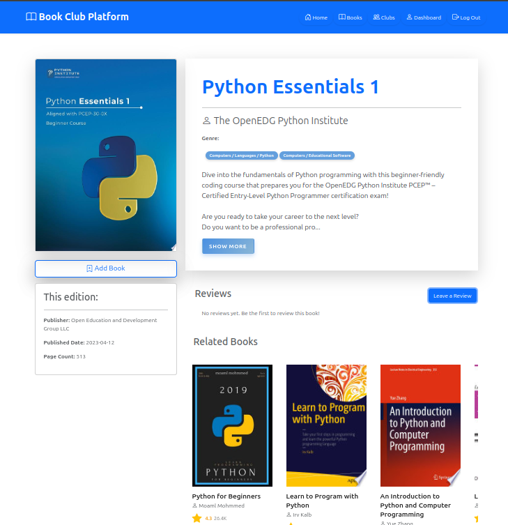
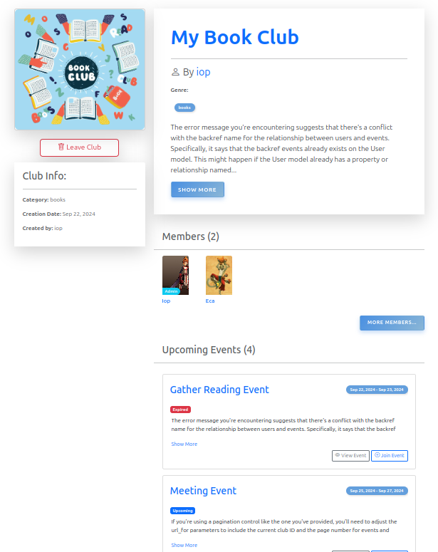

# Book Club Platform

The Book Club Platform is a Flask web application designed for book enthusiasts to connect, share their thoughts on books, and manage their book clubs. It allows users to create, join, and manage book clubs, engage in discussions, and rate books they have read. The platform provides a user-friendly interface with modern styling, ensuring a pleasant user experience.

## Table of Contents

- [Features](#features)
- [Technologies Used](#technologies-used)
- [Setup and Installation](#setup-and-installation)
- [Project Structure](#project-structure)
- [API Integration](#api-integration)
- [Database Models](#database-models)
- [Usage](#usage)
- [Screenshots](#screenshots)
- [Future Improvements](#future-improvements)
- [Contributing](#contributing)
- [License](#license)

## Features

- **User Authentication**: Secure registration and login for users.
- **Book Details Fetching**: Fetch additional details about books from the Google Books API (e.g., title, author, genre, description, and thumbnail image).
- **Book Search**: Users can search for books using a search bar.
- **Profile Dashboard**: Users have a personal profile dashboard where they can view their bookshelves, reviews, and participate in book clubs.
- **Book Clubs**: Users can create and manage book clubs, invite other users, and join existing clubs. Club members can discuss books, share reviews, and participate in events related to the book club.
- **Events Management**: Create and manage events related to book clubs.
- **Book Management**: Users can add, edit, delete, and view details of books.
- **Reviews and Ratings**: Leave reviews and ratings for books.
- **Related Books Suggestions**: Suggest related books based on genre or title keywords.
- **Weekly Updates**: Automatically update the database with popular books on a weekly basis.
- **Responsive Design**: The application is designed to work on various screen sizes, ensuring a smooth experience on both mobile and desktop devices.

## Technologies Used

- **Python**: Flask framework for backend development.
- **Flask-SQLAlchemy**: ORM for database interactions.
- **BeautifulSoup**: Web scraping library
- **Google Books API**: For retrieving additional book information.
- **Bootstrap**: For responsive UI design and styling.
- **HTML/CSS/JavaScript**: Frontend technologies.
- **SQLite**: Database for storing books and user data.
- **Version Control**: Git

## Setup and Installation

To run this project locally, follow these steps:

1. **Clone the repository**:
   ```bash
   git clone https://github.com/naoufalHdr1/Book_Club_Platform
   cd Book_Club_Platform
   ```

2. **Create a virtual environment**:
   ```bash
   python3 -m venv venv
   source venv/bin/activate   # For Windows use `venv\Scripts\activate`
   ```

3. **Install the required dependencies**:
   ```bash
   pip install -r requirements.txt
   ```

4. **Set up the environment variables**:
   Create a `.env` file and add the following variables:
   ```bash
   FLASK_APP=run.py
   FLASK_ENV=development
   SECRET_KEY=your-secret-key
   ```

5. **Initialize the database**:
   ```bash
   flask db init
   flask db migrate
   flask db upgrade
   ```

6. **Run the Flask development server**:
   ```bash
   flask run
   ```

7. **Access the application**:
   Open your browser and navigate to `http://127.0.0.1:5000`.

## Project Structure

```plaintext
book-club-platform/
│
├── app/
│   ├── __init__.py        # Application setup
│   ├── models.py          # SQLAlchemy models for Book, User, Review, Club, etc.
│   ├── forms.py           # Flask-WTF forms for user input
│   ├── routes.py          # Application routes and views
│   ├── templates/         # HTML templates for rendering pages
│   ├── static/            # Static files (CSS, JS, images)
│
├── migrations/            # Database migrations
├── venv/                  # Virtual environment
├── run.py                 # Entry point to start the app
└── requirements.txt       # Project dependencies
```

## API Integration

This project uses two main APIs:

1. **Google Books API**: For fetching detailed book information such as title, author, genre, description, and thumbnails.
   - `fetch_book_details(title, author)` is used to query the API for specific books and prioritize books with both descriptions and thumbnails.

2. **Goodreads Scraping**: Scrapes the list of popular books for the current month from Goodreads.
   - `scrape_books()` fetches book titles and authors using BeautifulSoup, processes them, and stores the results in the database.

## Database Models

### Book Model

| Field        | Type     | Description                         |
|--------------|----------|-------------------------------------|
| `id`         | Integer  | Primary Key                         |
| `title`      | String   | Book title                          |
| `author`     | String   | Book author                         |
| `genre`      | String   | Book genre                          |
| `description`| Text     | Book description                    |
| `thumbnail`  | String   | URL of the book's thumbnail         |
| `year`       | Integer  | The year the book was scraped       |
| `month`      | Integer  | The month the book was scraped      |

### User Model

| Field        | Type     | Description                         |
|--------------|----------|-------------------------------------|
| `id`         | Integer  | Primary Key                         |
| `username`   | String   | Unique username                     |
| `email`      | String   | User email                          |
| `password`   | String   | Hashed password                     |

### Club Model

| Field        | Type     | Description                         |
|--------------|----------|-------------------------------------|
| `id`         | Integer  | Primary Key                         |
| `name`       | String   | Club name                           |
| `description`| Text     | Description of the book club        |
| `members`    | List     | Users who are members of the club   |

Other models include `Bookshelf` and `Review` for managing user data, bookshelves, and reviews.

## Usage

### Scrape Popular Books
The app scrapes popular books from Goodreads for the current month using the `scrape_books()` function and stores them in the database. It fetches additional details from Google Books API and presents this data in a carousel on the homepage.

### Search for Books
Users can search for books using a search bar. The app fetches book data dynamically from the Google Books API and filters books based on search terms.

### View Book Details
Each book's details page displays a clean description, author, genres, and related books based on shared genres or title keywords.

### Profile Dashboard
Users have a personal profile dashboard where they can view and manage their bookshelves, see their reviews, and manage their account settings.

### Book Clubs
Users can create new book clubs, join existing ones, and manage their memberships. Each club has its own discussion area for book-related conversations and events.

### Write Reviews
Users can submit reviews and rate books they've read.

## Screenshots




## Future Improvements

- Add more advanced filters for book searches (e.g., filter by publication date, genre).
- Improve the design and responsiveness of the user interface.
- Implement a recommendation system based on users' reading preferences.

## Contributing

Contributions are welcome! Please follow these steps:

1. Fork the repository.
2. Create a new branch (`git checkout -b feature-branch`).
3. Make your changes and commit them (`git commit -m "Add feature"`).
4. Push to the branch (`git push origin feature-branch`).
5. Open a pull request.

## License

This project is licensed under the MIT License. See the [LICENSE](LICENSE) file for details.
